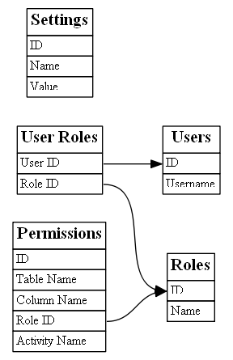

# WebDB

## What is WebDB?

WebDB is a database web interface aimed at non-technical users, providing simple
means to navigate and edit a database.  It is akin to phpMyAdmin, in that it
presents the data and structure of databases to the user for viewing and
modification, but where phpMyAdmin is a database administrator's tool, WebDB
tries to make things pretty and easy for users who are primarily interested in
the *data* (and not the schema).  For example: field names are properly
capitalised and formatted; foreign keys are presented as links to their referenced
records; and edit form fields are all matched to their underlying data types to
make it as easy as possible to enter data.  Many other features make WebDB a
(hopefully) useful prototyping or bare-bones database interface.

* **Download:** https://github.com/samwilson/kohana_webdb/archive/master.zip
* **Latest Version:** 6.0.0 (2015-01-23)
* **Licence:** Simplified BSD License
* **Homepage:** [http://github.com/samwilson/kohana_webdb](http://github.com/samwilson/kohana_webdb)
* **Established:** March 2008
* **Author:** Sam Wilson

## Quick Start

1. Download and uncompress in a web-accessible location.

2. Copy `config.dist.php` to `config.php` and edit the database connection
   credentials and other base configuration therein.

3. Navigate to the URL at which you installed WebDB (e.g.
   http://example.org/kohana_webdb/). You will be prompted to install the
   application. Click 'Install'.

4. Add custom tables to your database (via any DB administration tool, such as
   [phpMyAdmin](http://www.phpmyadmin.net/)).

## Schema Structure and Nomenclature

The base tables provided by WebDB are shown in the Entity Relationship Diagram
below. These must not be renamed, but new columns can be added where required.

For their records be edited or viewed, tables need to have single-column primary
keys, with values that can be included in URLs. For example, autoincrementing
integers.

## Access Control

WebDB has a number of different options for user authentication and
authorisation. Credentials can be supplied from the Database configuration
file, user input, or elsewhere (such as an LDAP server) — and are generally a
combination of these. How they are combined, and the options for further
refining users' permissions, are detailed below.

### Authentication:

* If valid connection details are provided in `application/config/database.php`
  then these will be used to connect to the database.  The user will at this
  point have all of the permissions of the database user.  Note that if the
  MySQL anonymous user (who has an empty username) is present, then its access
  will apply at this point.
* User authentication is handled by the Auth module, and so any drivers for that
  module can be used.  The DB driver (provided with WebDB) can be used to
  authenticate as MySQL users.
* If a valid MySQL user is given in the Database configuration file, and a
  driver other than DB is selected in the Auth configuration file, then users
  authenticate against that other driver, and if logged in will have all of
  the permissions of the MySQL user.

### Authorisation:

* 

## Other Features

* **Table and column comments** are displayed wherever appropriate.  For MySQL,
  column comments are limited to 255 characters, and table comments to only 60
  characters.
* **Foreign keys** are shown as links to their foreign rows, or (when being
  edited) as drop-down lists (either normal HTML ones, for short lists, or AJAX
  auto-complete ones, for longer lists).
* Users can **filter** by any column and a range of operations ('contains',
  'is empty', 'equals', etc.).  This includes searching foreign keys for values
  found in the 'title column' of the foreign table.
* The first non-primary unique key is used as a table's 'title column', and
  displayed wherever a table is referred to from another table (i.e. from a
  foreign key).
* An **import** feature allows data in CSV format to be brought into a database,
  undergoing required sanity-checking and transformation (for e.g. foreign keys)
  on the way.

## Simplified BSD License

Copyright &copy; 2014, Sam Wilson.  All rights reserved.

Redistribution and use in source and binary forms, with or without modification,
are permitted provided that the following conditions are met:

* Redistributions of source code must retain the above copyright notice, this
  list of conditions and the following disclaimer.
* Redistributions in binary form must reproduce the above copyright notice, this
  list of conditions and the following disclaimer in the documentation and/or
  other materials provided with the distribution.

This software is provided by the copyright holders and contributors "as is" and
any express or implied warranties, including, but not limited to, the implied
warranties of merchantability and fitness for a particular purpose are
disclaimed. In no event shall the copyright holder or contributors be liable for
any direct, indirect, incidental, special, exemplary, or consequential damages
(including, but not limited to, procurement of substitute goods or services;
loss of use, data, or profits; or business interruption) however caused and on
any theory of liability, whether in contract, strict liability, or tort
(including negligence or otherwise) arising in any way out of the use of this
software, even if advised of the possibility of such damage.
